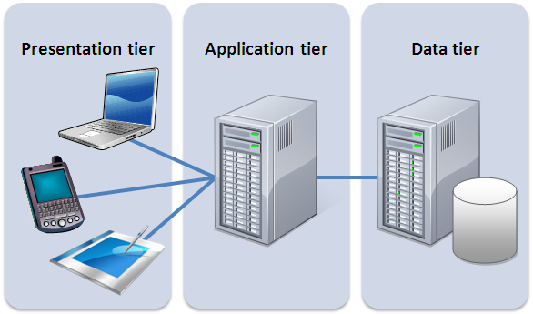
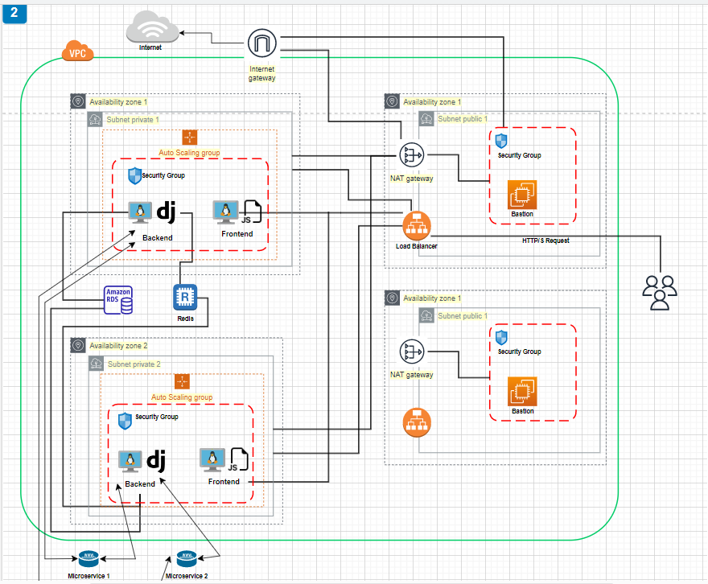

#DESCRIPCION 
---

Se elige una arquitectura de 3 niveles básica como una implementación popular del diseño de software cliente-servidor para implementar en la nube publica de AWS. 
Esta ***three tier architecture*** incluye un nivel de presentación (capa web para el cliente), un nivel lógico (la capa de aplicación) y un nivel de datos (que contiene una capa de base de datos).

##Los beneficios de esta infraestructura son:

- escalabilidad: cada elemento se puede escalar horizontalmente, ya que cada instancia EC2 puede desplegar las aplicaciones.

- integridad y seguridad de la base de datos: el cliente no puede acceder directamente a los datos, sin una capa de aplicación entre ellos y la base de datos.

- rendimiento mejorado: el nivel de presentación puede almacenar en caché las solicitudes, lo que minimiza la utilización y la carga de la red.

- fácilidad de mantener y modificar: las modificaciones o el reemplazo de un nivel no afectan a los otros niveles (desacoplamiento), varios desarrolladores pueden trabajar en las diferentes capas, lo que reduce el costo y el tiempo necesarios para integrar los cambios.

